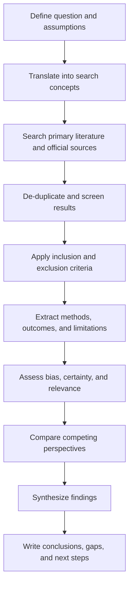

# Topic-Agnostic Deep Research Template for an Unspecified Topic

## Executive Summary

The topic, timeframe, jurisdiction, and target depth are unspecified. Because of that, the most rigorous useful output is not a pseudo-specific summary, but a **reusable deep-research framework** that can be applied once a concrete topic is supplied. This report therefore provides a professional template for scoping, searching, screening, evaluating, and synthesizing evidence; a structure for handling competing perspectives; and a source-priority ladder that favors **primary sources, official documents, and original papers** over commentary. The workflow is grounded in established evidence-synthesis guidance such as PRISMA 2020, the Cochrane Handbook, PubMed’s official search documentation, and the GRADE framework for judging certainty and recommendation strength. citeturn6view0turn7view0turn22view0turn4view0turn23view0

To make the template concrete, the report also shows how it would look for three sample topics from different domains: a scientific example on the learning-styles hypothesis, a policy example on urban congestion pricing, and a technology example on retrieval-augmented generation. For each, it includes a short literature map and starter search queries. Where possible, the examples point first to official program pages, original research papers, benchmarks, and standards. citeturn14view0turn14view1turn15academia0turn20academia0turn16view0

A practical rule sits underneath the whole template: when specifics are missing, do **not** overclaim. Instead, state what is unspecified, document assumptions, keep the search reproducible, and separate what is well-supported from what is provisional or contested. That principle is consistent with systematic-review reporting norms and evidence-certainty frameworks. citeturn7view0turn22view0turn23view0

## Scope and Objectives

Because the request does not identify a specific topic, the scope must be written as a fillable brief. The goal of the template is to let a researcher convert an ambiguous request into a disciplined review without needing to restart the process.

A strong default scope statement looks like this:

| Field | Default template entry | How to adapt when topic is provided |
|---|---|---|
| Topic | **Unspecified** | Replace with the exact phenomenon, intervention, policy, technology, or claim under study |
| Core question | “What does the highest-quality evidence show about **[topic]**?” | Turn into a causal, descriptive, evaluative, or forecasting question |
| Decision context | **Unspecified** | Clarify whether the review supports strategy, product design, pedagogy, clinical action, regulation, procurement, or public communication |
| Timeframe | **Unspecified** | Set an explicit review window, usually “seminal papers + last 5 years,” unless the field requires a longer historical arc |
| Geography/jurisdiction | **Unspecified** | Specify global, country-level, state-level, sectoral, or organizational scope |
| Deliverable type | Analytical research report | Narrow to memo, technical brief, literature review, evidence map, or decision note |
| Evidence standard | Primary and official sources first | Tighten to RCTs, causal inference studies, laws/regulations, standards, or production benchmarks as appropriate |

When a concrete topic arrives, the objectives should usually be rewritten into four explicit aims: define the question, map the evidence base, test major perspectives, and produce an action-relevant conclusion. That is the minimum structure needed for a review to stay reproducible and decision-useful. PRISMA 2020 formalizes transparent reporting, while Cochrane emphasizes explicit eligibility criteria, source selection, and documentation of the search and selection process. citeturn7view0turn22view0

A compact objective template is:

> This review assesses **[topic]** for **[decision context]** by examining primary studies, official reports, and high-quality syntheses; comparing competing explanations or policy positions; evaluating evidence quality and uncertainty; and identifying the strongest supported conclusions, remaining gaps, and next research steps.

## Methodology

A professional deep-research process should be **systematic enough to be auditable** but flexible enough to work across domains. Cochrane recommends comprehensive searching across multiple source classes, high-sensitivity search design, and use of both controlled vocabulary and free-text terms. PRISMA 2020 supplies the reporting spine, and GRADE supplies one of the clearest structures for rating certainty in a body of evidence and moving from evidence to conclusions or recommendations. citeturn22view0turn6view0turn23view0

The default methodology should contain these elements:

| Component | Template standard | Why it matters |
|---|---|---|
| Question framing | Use a structure such as PICO/PICOS, SPICE, or a systems/policy variant | Keeps the search and appraisal tied to a real decision problem citeturn23view0 |
| Source classes | Search academic databases, trial/registry sources where relevant, official agency pages, standards bodies, and major benchmark repositories | Cochrane explicitly recommends searching beyond a single database and including trials registers and regulatory sources where relevant. citeturn22view0 |
| Search construction | Combine synonyms with OR inside each concept, then intersect concepts with AND; use both free-text and subject headings when available | This improves recall while keeping the logic explicit and reproducible. citeturn22view0 |
| Screening | Apply prespecified inclusion and exclusion criteria at title/abstract and full-text stages | Prevents post hoc cherry-picking. citeturn7view0turn22view0 |
| Appraisal | Judge methodology, relevance, bias, indirectness, inconsistency, imprecision, and publication bias | These are central GRADE dimensions for certainty assessment. citeturn23view0 |
| Reporting | Preserve search strings, databases searched, dates searched, and reasons for exclusion | PRISMA 2020 treats transparent reporting as core, not optional. citeturn7view0turn6view0 |

A topic-agnostic database plan can be written this way:

| Domain | Primary search locations |
|---|---|
| Health/biomedicine | PubMed, trial registries, regulatory sources |
| Education/social science | Field databases, major journals, institutional research centers, policy repositories |
| Computing/engineering | Publisher libraries, conference proceedings, arXiv, benchmarks, standards bodies |
| Policy/economics | Implementing agencies, legislation and rulemaking portals, central banks/ministries, OECD/World Bank/NBER-type repositories |
| Technology governance | Standards bodies, official policy frameworks, system cards, benchmark papers, security advisories |

PubMed’s official description is especially useful as a model for what a field-specific database contributes: it is a free NIH/NLM resource for biomedical and life-sciences literature, includes over 40 million citations and abstracts, and supports subject-heading-based retrieval through MEDLINE and MeSH. citeturn4view0

A reusable search-string template is:

```text
("main term" OR synonym* OR acronym*)
AND
("outcome" OR effect* OR performance OR impact)
AND
("context" OR population OR sector OR use case)
NOT
(unrelated homonym OR clearly irrelevant domain)
```

A reusable inclusion/exclusion template is:

| Inclusion criteria | Exclusion criteria |
|---|---|
| Directly addresses the review question | Off-topic or only tangentially related |
| Primary study, official document, benchmark, or high-quality synthesis | Pure opinion, marketing copy, unsourced blog content |
| Clear methods and analyzable evidence | Unclear methodology or unverifiable claims |
| Relevant geography, population, or system | Wrong setting unless used explicitly for contrast |
| Published within justified timeframe, plus seminal older works | Arbitrary recency-only selection without rationale |

The research workflow can be documented like this:



This flow mirrors the logic of PRISMA-style reporting and Cochrane’s search-and-selection guidance, while the appraisal stage aligns with GRADE’s structured certainty assessment. citeturn7view0turn22view0turn23view0

## Literature Review Framework

For an unspecified topic, the literature review should be built as a **hierarchy**, not a flat list. The right question is not merely “what sources exist?” but “which sources should carry the most weight?” Cochrane’s guidance to search across bibliographic databases, unpublished/ongoing-study sources, and regulatory materials is a good general starting point for source hierarchy, even outside medicine. citeturn22view0

A strong default evidence ladder is:

| Priority band | What belongs here | Typical use |
|---|---|---|
| Primary and official | Original experiments, field studies, laws, regulations, standards, agency dashboards, benchmark datasets, technical specs | Establish facts, methods, direct evidence |
| High-quality syntheses | Systematic reviews, meta-analyses, consensus statements, evidence reports | Summarize mature evidence bases |
| Official interpretive materials | Agency explainers, implementation guides, standard-setting notes | Clarify scope, definitions, compliance, operational details |
| Secondary institutional syntheses | University centers, professional societies, think tanks with citations | Fast orientation and source discovery |
| Commentary and news | Journalism, essays, practitioner summaries | Context only; not evidentiary foundation |

When adapting this template to a specific topic, the literature review should usually be narrated in this order:

First, define the object of study and the main subquestions.  
Second, summarize the best primary and official evidence.  
Third, bring in syntheses to show whether the field has converged.  
Fourth, identify where disagreement remains and why.  
Fifth, separate context-setting commentary from actual evidence.  

A useful literature-map table for any topic looks like this:

| Source | Type | What it answers | Strengths | Limitations |
|---|---|---|---|---|
| Source A | Primary study / official document | Core factual or causal claim | Direct evidence | Narrow scope or context |
| Source B | Systematic review / meta-analysis | State of accumulated evidence | Broad synthesis | May lag the latest studies |
| Source C | Official implementation source | Current operational reality | Authoritative and current | May not evaluate outcomes causally |
| Source D | Critical commentary | Alternative interpretation | Surfaces disputes and assumptions | Lower evidentiary weight |

One useful example of a **secondary institutional synthesis** is the uploaded University of Michigan article on the learning-styles myth. It is valuable for orienting a reader quickly and for surfacing a core bibliography, but it should still be ranked below original papers and formal reviews in the final evidence hierarchy. fileciteturn0file0

## Competing Perspectives and Critical Analysis

A rigorous report should not merely collect evidence that supports one favored conclusion. It should define the **live perspectives**, say what each side claims, and then test those claims against methodology, measurement, and incentives. PRISMA and Cochrane help with search completeness and reporting; GRADE helps with judging whether apparently conflicting results reflect differences in bias, indirectness, inconsistency, or imprecision instead of genuine substantive disagreement. citeturn7view0turn22view0turn23view0

A practical comparison matrix is:

| Perspective type | Typical claim | Best evidence test | Common failure mode |
|---|---|---|---|
| Consensus view | “Most evidence points in one direction” | Systematic reviews, replicated studies, official evaluation reports | Overstating certainty |
| Revisionist view | “The standard interpretation is incomplete or wrong” | New primary evidence, superior identification strategy, stronger benchmark | Confusing novelty with strength |
| Contextualist view | “It depends on population, setting, or implementation” | Subgroup analysis, heterogeneity tests, multiple jurisdictions | Turning every result into “it depends” |
| Advocacy position | “This should be adopted/rejected” | Evidence plus explicit values, costs, tradeoffs, governance | Smuggling values in as facts |

For professional use, each competing perspective should be tested with five questions:

| Test | What to ask |
|---|---|
| Definition test | Are parties using the same terms? |
| Measurement test | Are they measuring outcomes, proxies, or preferences? |
| Identification test | Is the design actually capable of supporting the claim? |
| Generalization test | Does evidence travel across populations, sectors, or jurisdictions? |
| Incentive test | Who benefits from this framing, and does that affect source reliability? |

This section is where many reports either become superficial or become genuinely useful. The difference is whether the report explicitly distinguishes: **proved**, **supported but context-limited**, **plausible but not established**, and **editorial or advocacy overlay**. That distinction is exactly the kind of structured judgment evidence-certainty frameworks were built to support. citeturn23view0

## Evidence Synthesis and Conclusions

For an unspecified topic, the conclusion section should be written as a synthesis template rather than a false topic-specific verdict. A good evidence synthesis does three things at once: it states the directional conclusion, marks certainty, and explains the main boundary conditions. Cochrane’s emphasis on systematic identification and GRADE’s emphasis on body-of-evidence judgments support this style of conclusion. citeturn22view0turn23view0

A reusable synthesis format is:

| Conclusion field | Template language |
|---|---|
| Main finding | “The strongest available evidence suggests that **[finding]**.” |
| Certainty | “Confidence is **[high / moderate / low]** because the evidence base is **[brief rationale]**.” |
| Boundary conditions | “This conclusion may not generalize to **[population / context / implementation condition]**.” |
| Key uncertainty | “The main unresolved issue is **[question]**.” |
| Action implication | “For decision-making, this supports **[practical implication]**, while reserving judgment on **[open area]**.” |

A model final paragraph, once the topic is known, would look like this:

> On balance, the evidence indicates that **[topic-specific conclusion]**. Confidence is **[level]** because the underlying studies are **[methodologically strong / mixed / limited]**, the results are **[consistent / heterogeneous]**, and the main threats to interpretation are **[bias, indirectness, implementation differences, benchmark weakness, etc.]**. The conclusion is strongest for **[contexts]** and least secure for **[contexts]**. Decision-makers should therefore treat **[claim A]** as established, **[claim B]** as promising but provisional, and **[claim C]** as unsupported or still unresolved. citeturn23view0

If a specific topic is later supplied, the fastest way to adapt this report is to replace the placeholder fields, rerun the methodology with explicit source logs, and convert the generic synthesis statements into topic-specific claims with direct citations.

## Open Questions and Recommended Next Steps

Since the exact topic is missing, the open-question section has to identify what would most improve the review once the topic is known. In practice, the missing details usually cluster into four categories: the exact object under study, the decision context, the relevant timeframe, and the acceptable evidence standard.

A disciplined next-step sequence is:

| Immediate next step | What to decide |
|---|---|
| Clarify topic | The exact claim, intervention, system, or policy to study |
| Clarify use case | Why the review is being commissioned and what decision it must support |
| Clarify scope | Jurisdiction, population, sector, and historical window |
| Clarify standard | Whether the bar is causal inference, technical performance, legal compliance, or implementation feasibility |

Once those are known, the report can be upgraded into one of three professional deliverables:

| Deliverable | Best when | Output |
|---|---|---|
| Evidence map | The field is broad and messy | Source landscape, clusters, gaps |
| Analytical review | The question is evaluative | Comparative synthesis and conclusion |
| Decision memo | Action is imminent | Bottom line, risks, options, recommended course |

If the topic is fast-moving, the next-step plan should also include a currency check against the most recent official pages, standards, or program documents. This matters especially in public policy and technology governance, where program rules, standards, and risk frameworks can change materially over short periods. NIST’s AI Risk Management Framework page, for example, explicitly notes that AI RMF 1.0 is under revision and highlights later generative-AI and critical-infrastructure materials; similar recency checks are good practice in any changing domain. citeturn16view0

## Sample Topic Blueprints and Annotated Reliable Sources

### Scientific example

A good scientific example for this template is **the learning-styles hypothesis**: does matching instruction to a learner’s preferred modality improve learning outcomes? The uploaded University of Michigan roundup is a strong secondary entry point because it summarizes the core dispute, distinguishes preferences from validated learning improvements, and points to landmark papers including Pashler, Cuevas, Kirschner, Coffield, and Rogowsky. fileciteturn0file0

**Short literature map**

| Source cluster | Illustrative source | Role in the review |
|---|---|---|
| Institutional overview | University of Michigan roundup on the learning-styles myth fileciteturn0file0 | Fast orientation and bibliography discovery |
| Foundational critical review | Pashler et al. (2008), as listed in the uploaded roundup fileciteturn0file0 | Tests whether the “meshing hypothesis” has credible evidence |
| Later synthesis and critique | Cuevas (2015), Kirschner (2017), Rogowsky et al. (2020), as listed in the uploaded roundup fileciteturn0file0 | Tracks whether the evidence base changed materially over time |

**Suggested search queries**

```text
("learning styles" OR VARK OR "meshing hypothesis") AND (achievement OR retention OR comprehension)
("learning preferences" AND teaching) NOT ("learning styles" as preference only)
(site:.edu OR site:.gov OR site:.org) "learning styles" systematic review
```

**What the final review would test**

The critical distinction is whether studies measure **preferences** or **learning gains**. That distinction is central to the scientific status of the claim and should be explicit throughout the review. The uploaded University of Michigan source is especially useful here because it makes that distinction clearly for non-specialist readers. fileciteturn0file0

### Policy example

A strong policy example is **urban congestion pricing**. This topic naturally requires both official implementation documents and independent evaluation evidence, because the central questions are not just whether the policy exists, but how it is designed, what outcomes it measures, and how transferable those outcomes are across cities. Official sources from the implementing agencies are the correct starting point. The MTA’s Congestion Relief Zone page defines the Manhattan zone, toll logic, and capital-program rationale; TfL’s congestion-charge page defines the London charge amount, operating hours, and exemptions. citeturn14view0turn14view1

**Short literature map**

| Source cluster | Illustrative source | Role in the review |
|---|---|---|
| Implementing authority | MTA Congestion Relief Zone citeturn14view0 | Current official program scope and intended funding logic |
| Comparator jurisdiction | TfL Congestion Charge citeturn14view1 | Long-running operational benchmark from another city |
| Independent modeling/evaluation | Liang et al. (2024) NYC CBD tolling simulation citeturn21academia1 | Policy-design assumptions and likely mechanism tests before or alongside rollout |

**Suggested search queries**

```text
("congestion pricing" OR "road user charging") AND (traffic OR emissions OR ridership)
site:mta.info "congestion relief zone"
site:tfl.gov.uk "congestion charge" impacts OR publications
("difference-in-differences" OR causal OR welfare) AND "congestion pricing"
```

**What the final review would test**

The central policy questions are usually distributional and implementation-specific: Who pays, who benefits, whether congestion is shifted rather than reduced, how revenue is used, and whether air-quality or transit effects are causally attributable to the program rather than concurrent changes. Those questions require combining official program documents with independent evaluation designs. citeturn14view0turn14view1turn21academia1

### Technology example

A strong technology example is **retrieval-augmented generation for enterprise question answering**. This topic benefits from a very clean evidence ladder: foundational model paper first, benchmark/evaluation papers second, then deployment and governance materials. The original RAG paper by Lewis et al. defines the architecture; BEIR gives a benchmark perspective on retrieval evaluation; later work tests deployment tradeoffs and robustness; and NIST’s AI RMF materials help frame governance and deployment risk. citeturn15academia0turn20academia0turn19academia0turn19academia1turn16view0

**Short literature map**

| Source cluster | Illustrative source | Role in the review |
|---|---|---|
| Foundational architecture | Lewis et al. (2020) RAG paper citeturn15academia0 | Establishes the core retrieval-plus-generation formulation |
| Retrieval benchmark | BEIR benchmark paper citeturn20academia0 | Frames retrieval quality and efficiency tradeoffs |
| Mature overview | Gao et al. (2023) RAG survey citeturn15academia1 | Organizes the design space and evaluation issues |
| Deployment robustness | Wang et al. (2024) and Yan et al. (2024) citeturn19academia0turn19academia1 | Best-practice and corrective workflow evidence |
| Governance | NIST AI RMF and GenAI profile context citeturn16view0 | Risk framing for production deployment |

**Suggested search queries**

```text
("retrieval-augmented generation" OR RAG) AND ("enterprise QA" OR "knowledge-intensive")
("retrieval benchmark" OR BEIR) AND (dense OR sparse OR hybrid OR rerank*)
site:nist.gov "AI Risk Management Framework" generative AI
("hallucination" AND RAG) AND (evaluation OR benchmark OR robustness)
```

**What the final review would test**

The core technology questions are rarely just “does RAG work?” They are usually about **which retrieval setup works under what latency, corpus, grounding, and governance constraints**. The best papers therefore do not only report generation quality; they also surface retrieval quality, benchmark heterogeneity, and robustness when retrieval degrades. citeturn15academia0turn20academia0turn19academia0turn19academia1turn16view0

### Annotated reliable-source ladder

The following source ladder can be reused for almost any topic:

| Priority | Source type | Why it should come early | Typical caveat |
|---|---|---|---|
| Highest | Original papers, official rules, technical specs, benchmark datasets | Closest to the underlying evidence or governing text | Can be narrow or hard to interpret in isolation |
| High | Systematic reviews and meta-analyses | Efficient summary of mature literatures | May lag fast-moving fields |
| High | Official program/framework pages | Best source for current operational details | Often describe rather than causally evaluate |
| Moderate | Institutional syntheses | Good for orientation and bibliography building | Lower evidentiary weight than originals |
| Lowest | News/commentary | Useful for context and recency | Should not anchor core conclusions |

This ordering is consistent with systematic-search and certainty-assessment norms: search broadly, report transparently, and then weight evidence by directness, methodological quality, and certainty rather than by convenience or rhetorical force. citeturn22view0turn23view0turn7view0

### Full references

Cochrane. *Chapter 4: Searching for and selecting studies*. In: Higgins JPT, Thomas J, Chandler J, Cumpston M, Li T, Page MJ, et al., editors. *Cochrane Handbook for Systematic Reviews of Interventions*, version 6.5.1. Last updated March 2025. citeturn22view0

EQUATOR Network. *The PRISMA 2020 statement: An updated guideline for reporting systematic reviews*. Guideline record linking to simultaneous journal publications and checklist resources. 2021. citeturn6view0

Gao Y, Xiong Y, Gao X, Jia K, Pan J, Bi Y, Dai Y, Sun J, Wang M, Wang H. *Retrieval-Augmented Generation for Large Language Models: A Survey*. arXiv, 2023. citeturn15academia1

GRADE Working Group. *GRADE Handbook*. GradePro / Guideline Development Tool handbook for rating certainty of evidence and strength of recommendations. citeturn23view0

Lewis P, Perez E, Piktus A, Petroni F, Karpukhin V, Goyal N, Küttler H, Lewis M, Yih W-t, Rocktäschel T, Riedel S, Kiela D. *Retrieval-Augmented Generation for Knowledge-Intensive NLP Tasks*. arXiv, 2020. citeturn15academia0

Liang Q, Yao R, Zhang R, Chen Z, Wu G. *Agent-based Simulation Evaluation of CBD Tolling: A Case Study from New York City*. arXiv, 2024. citeturn21academia1

Metropolitan Transportation Authority. *Congestion Relief Zone*. Official MTA Bridges and Tunnels program page. citeturn14view0

National Institute of Standards and Technology. *AI Risk Management Framework*. Official NIST overview page for AI RMF, related guidance, and later generative-AI materials. citeturn16view0

Page MJ, McKenzie JE, Bossuyt PM, Boutron I, Hoffmann TC, Mulrow CD, Shamseer L, Tetzlaff JM, Akl EA, Brennan SE, Chou R, Glanville J, Grimshaw JM, Hróbjartsson A, Lalu MM, Li T, Loder EW, Mayo-Wilson E, McDonald S, McGuinness LA, Stewart LA, Thomas J, Tricco AC, Welch VA, Whiting P, Moher D. *The PRISMA 2020 statement: An updated guideline for reporting systematic reviews*. 2021. citeturn6view0turn7view0

PubMed / NCBI / U.S. National Library of Medicine. *About PubMed*. Official description of scope, components, and coverage. Last updated March 11, 2025. citeturn4view0

Straub EO. *Roundup on Research: The Myth of ‘Learning Styles’*. University of Michigan, Center for Academic Innovation, published 2024 and updated 2025; uploaded in this conversation. fileciteturn0file0

Thakur N, Reimers N, Rücklé A, Srivastava A, Gurevych I. *BEIR: A Heterogenous Benchmark for Zero-shot Evaluation of Information Retrieval Models*. arXiv, 2021. citeturn20academia0

Transport for London. *Congestion Charge*. Official TfL operational page. citeturn14view1

Wang X, Wang Z, Gao X, Zhang F, Wu Y, Xu Z, Shi T, Wang Z, Li S, Qian Q, Yin R, Lv C, Zheng X, Huang X. *Searching for Best Practices in Retrieval-Augmented Generation*. arXiv, 2024. citeturn19academia0

Yan S-Q, Gu J-C, Zhu Y, Ling Z-H. *Corrective Retrieval Augmented Generation*. arXiv, 2024. citeturn19academia1
