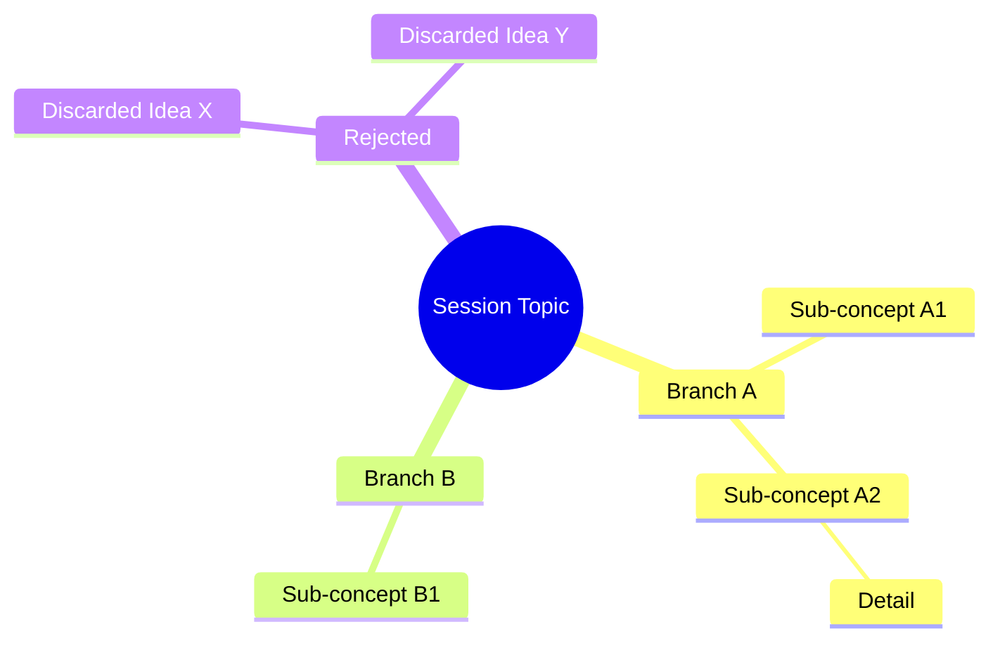

# Session Handoff — Zero-Loss Context Packaging

## Purpose

This skill transforms a live session's full discourse — explicit content, latent intent,
rejected paths, and intuitive leaps — into a structured, machine-and-human-readable
**Handoff Package**. The goal is that a future agent (or the same user returning later)
can resume work immediately without re-reading the full history.

The package captures not just *what was said* but *why*, *what was rejected*, and
*what was felt* — the liminal state that typically evaporates between sessions.

---

## Step 0: Read References

Before generating anything, locate this skill's directory (it will be wherever this SKILL.md
lives) and read the schema reference:

```
view <this-skill-directory>/references/state_schema.md
```

This contains the exact JSON schema for `01_state_snapshot.json` and field-level guidance.
The skill also contains validation scripts in `<this-skill-directory>/scripts/`.

---

## Step 1: Classify the Session

Determine these parameters from the conversation history (ask the user only if genuinely ambiguous):

| Parameter | Options |
|-----------|---------|
| **Scope** | Ideation · Debugging · Refactoring · Architecture · Creative Writing · Research · Mixed |
| **Domain** | Software Engineering · Physics/Math · Philosophy · Creative · Business/Strategy · Mixed |
| **Depth** | Short (<10 exchanges) · Deep Dive (10-50) · Marathon (50+) |
| **Urgency** | Low · Medium · Critical |
| **Next Owner** | User · AI · Specific Role |

These parameters shape how you weight different parts of the package. A debugging session
needs verbatim error codes; a philosophy session needs dialectic tracking; a creative
session needs tonal preservation.

---

## Step 2: Signal Extraction

Scan the full session history using domain-adapted parsing:

### Engineering Sessions
- Preserve: stack traces, error codes, UUIDs, function signatures, file paths, diffs,
  dependency versions, architecture decisions, environment variables
- Extract: the causal chain of bugs/fixes, what was tried and failed

### Physics / Math Sessions
- Preserve: LaTeX expressions verbatim (do not simplify), constants, derivation steps,
  notation conventions, coordinate choices
- Extract: which steps are proved vs. assumed vs. conjectured, layer dependencies

### Philosophy / Creative Sessions
- Preserve: dialectic shifts, metaphor evolution, tonal changes, key phrasings that
  carry semantic load
- Extract: thesis evolution, which framings were abandoned and why

### Business / Strategy Sessions
- Preserve: KPIs, OKRs, resource constraints, stakeholder positions, timelines
- Extract: decision rationale, risk assessments, trade-offs made

**Noise filtering:** Strip conversational filler ("Thanks!", "Can you check?") but
*always preserve the intent* behind the query. If "Can you check?" was really
"I suspect this is wrong but I'm not sure where" — capture that suspicion.

---

## Step 3: Liminal Analysis

This is the highest-value, hardest-to-reconstruct layer. Capture:

1. **Rejected Paths** — Ideas discussed and discarded. Record *why* they were rejected
   so the next session doesn't regress into re-exploring them.

2. **Assumptions** — Leaps in logic that weren't fully proven but were treated as true.
   Label each explicitly as `[Assumption]` with confidence level (high/medium/low).

3. **Intuitions** — Hunches, pattern-recognitions, "I think this might connect to..."
   moments that haven't been formalized yet. These are often the most valuable signals.

4. **Tonal State** — Was the session exploratory and loose? Rigid and debugging-focused?
   Frustrated and blocked? Triumphant and building? The next agent needs to match this
   energy or consciously shift it.

5. **Unfinished Threads** — Topics that were raised but not resolved, questions asked
   but not answered, tangents that might be important later.

6. **Emergent Connections** — Abstract links between concepts that surfaced during
   discussion but weren't the main focus. These often become the main focus next time.

---

## Step 4: Generate the Package

Create all files in `/home/claude/handoff/` and then copy to `/mnt/user-data/outputs/handoff/`.

### File Manifest

```
handoff/
  00_executive_narrative.md      — The "Story of the Session"
  01_state_snapshot.json         — Machine-readable context (validated against schema)
  02_active_context.md           — Current focus, hot paths, immediate blockers
  03_concept_map.mmd             — Mermaid mindmap of entities/relationships explored
  04_decision_log.md             — Decisions made, alternatives rejected, rationale
  05_liminal_space.md            — Intuitions, assumptions, tone, "the unsaid"
  06_next_actions.md             — Prioritized action matrix with difficulty estimates
  07_environment_spec.md         — Technical environment, axioms, constants assumed
```

### File-by-File Instructions

#### `00_executive_narrative.md`

Write this as **cohesive paragraphs**, not bullet points. Tell the story of the session
as a causal chain:

> "The session began with X. We explored Y, which led to the discovery that Z.
> This contradicted our earlier assumption about W, so we pivoted to A. The key
> breakthrough was B, which resolved the original question but opened new questions
> about C and D."

Structure: Opening context → Key developments (chronological) → Turning points →
Current state → What's next. The reader should understand the *arc* of the session.

#### `01_state_snapshot.json`

Must validate against the schema in `references/state_schema.md`. Key fields:

- `status`: one of `stable | volatile | blocked | complete`
- `focus.cursor_position`: a plain-language description of where we are in the
  problem space — not a file path, but a conceptual location
- `entities`: every significant noun — projects, functions, theorems, people,
  files, concepts — with type, state, and definition
- `knowledge_graph`: adjacency list showing how entities relate
- `sentiment.frustration_level`: 0.0 (calm exploration) to 1.0 (deeply blocked)

Run the validation script after generating:

```bash
python <this-skill-directory>/scripts/validate_snapshot.py /home/claude/handoff/01_state_snapshot.json
```

#### `02_active_context.md`

The "dashboard" view. Contains:

- **Primary Focus**: What we're actively working on right now
- **Hot Paths**: Lines of investigation that are live and promising
- **Blockers**: What's preventing progress, with specificity
- **Dependencies**: What needs to happen before what
- **Quick Resume Instructions**: 2-3 sentences a new agent can read to start immediately

#### `03_concept_map.mmd`

A Mermaid mindmap showing the session's conceptual territory. Use this structure:



Color-code or label: active paths vs. rejected paths vs. open questions.
Keep it to 15-30 nodes — enough to map the territory, not so many it's noise.

After generating, validate it renders:

```bash
python <this-skill-directory>/scripts/render_mermaid.py /home/claude/handoff/03_concept_map.mmd
```

#### `04_decision_log.md`

For each significant decision in the session:

```
### Decision: [Short title]
- **Chosen**: [What was decided]
- **Alternatives considered**: [What else was on the table]
- **Rationale**: [Why this path was chosen]
- **Confidence**: [High/Medium/Low]
- **Reversibility**: [Easy/Hard/Irreversible]
- **Downstream effects**: [What this decision constrains or enables]
```

#### `05_liminal_space.md`

The most unusual and valuable file. Contains:

- **Session Tone**: Paragraph describing the emotional/intellectual texture
- **Unspoken Assumptions**: Things treated as true without explicit proof
- **Intuitive Leaps**: Pattern-recognitions that haven't been formalized
- **Rejected Ideas (with burial reasons)**: Why each was abandoned
- **Emergent Threads**: Connections that surfaced but weren't pursued
- **Open Questions**: Things we don't know yet but should
- **Meta-Observations**: Patterns in how the session itself evolved

Write this in a reflective, observational tone. This file is where the
"between the lines" content lives.

#### `06_next_actions.md`

An action matrix, not just a list:

```
| Priority | Action | Owner | Difficulty | Confidence | Dependencies | Notes |
|----------|--------|-------|------------|------------|--------------|-------|
| P0       | ...    | User  | Medium     | 85%        | None         | ...   |
| P1       | ...    | AI    | Hard       | 60%        | P0           | ...   |
```

- **Priority**: P0 (do immediately) through P3 (backlog)
- **Difficulty**: Easy / Medium / Hard / Unknown
- **Confidence**: How sure we are this is the right next step (0-100%)

#### `07_environment_spec.md`

Everything about the technical/intellectual environment:

- Language/framework versions, OS, hardware constraints
- Library dependencies with exact versions
- Environment variables and configuration
- For physics/math: coordinate systems, notation conventions, axiom sets
- For philosophy: philosophical framework, key terms defined
- For creative: voice guidelines, audience, format constraints

---

## Step 5: Quality Gates

Before presenting the package, self-evaluate on these axes (score 0-5 each):

1. **Resumability** — Can a new model start work in <10 seconds of reading `02_active_context.md`?
2. **Ambiguity Reduction** — Are all pronouns resolved to specific entities?
3. **Context Density** — Is the signal-to-noise ratio maximized?
4. **Liminal Capture** — Did we save intent, not just text?
5. **Completeness** — Are all 8 files present and non-trivial?

**Minimum passing score: 20/25.** If below, identify the weakest file and improve it.

Also identify: **Top Risk** — the single most critical piece of context that is
missing or ambiguous in the current session. State it explicitly so the user can
address it before closing out.

---

## Step 6: Present the Package

1. Copy all files to `/mnt/user-data/outputs/handoff/`
2. Present using `present_files` — lead with `00_executive_narrative.md`
3. State the quality gate scores
4. State the Top Risk
5. Offer to adjust any file before the user closes the session

---

## Anti-Patterns to Avoid

- **Bullet-point narratives**: The executive narrative must be paragraphs, not lists
- **Vague cursor positions**: "Working on the code" is useless. "Debugging the race
  condition in `sync_manager.py:L142` where the mutex lock isn't releasing on timeout"
  is useful.
- **Missing rejection reasons**: Every rejected path needs a *why*
- **Sentiment whitewashing**: If the session was frustrating, say so. The next agent
  needs to know.
- **Entity ambiguity**: Every "it", "that", "the thing" must be resolved to a named entity
- **Redundancy across files**: Each file has a specific purpose. Don't repeat the
  narrative in the decision log or the next actions in the active context.
